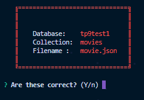

## Instructions

### Installation

#### Pre-Requisite is to have mongo installed in the system

In the directory of **'jsonimporter'** run: 
```
npm link
```

### Usage

##### Windows (make sure PATH variable for **'\AppData\Roaming\npm'** is set)
```
jsonimporter --db tp9test1 --cl movies --fn movie.json
```

##### Linux or Mac
```
jsonimporter --db tp9test1 --cl movies --fn movie.json
```




